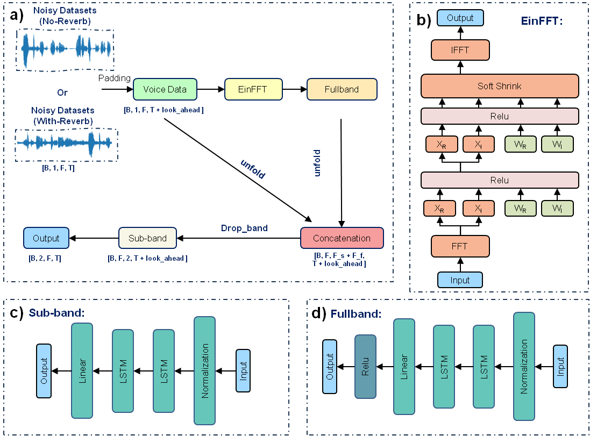
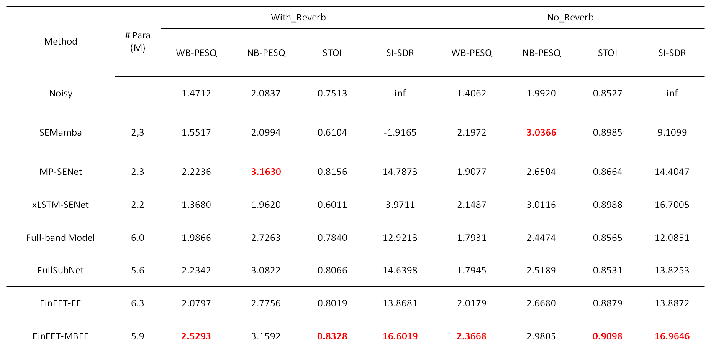

# EinFFT-MBFF: Einstein Matrix-Optimized Multiscale Frequency Band Fusion Framework for Speech Denoising

This repository contains the official implementation of ​**EinFFT-MBFF**, a framework for speech denoising based on Einstein matrix optimization and multiscale frequency band fusion.

## Requirements

- Python >= 3.10
- PyTorch == 1.12

## Model

### Architecture


The EinFFT-MBFF model combines Einstein matrix optimization with multiscale frequency band fusion techniques to improve speech denoising performance in challenging noise environments.

### Speech Denoising Results


We have compared the performance of EinFFT-MBFF with traditional models. The graph below shows the evaluation scores for different methods:


## Training the Model

### Step 1: Prepare Dataset
The `.txt` files are merely a list of files in the dataset folders (clean and noisy), so they should be created according to the content of your dataset. You can create a list of files using a bash script or simply the following commands in Linux/macOS terminal. Here is my suggestion, assuming that your clean, noise, and RIR datasets are in a folder like `~/Datasets/DNS-Challenge-INTERSPEECH/datasets/clean`, `/noise`, and `/rir`:

```bash
cd ~/Datasets/DNS-Challenge-INTERSPEECH/datasets/clean
find "$PWD" -type f -name "*.wav" > clean_0.6.txt

cd ~/Datasets/DNS-Challenge-INTERSPEECH/datasets/noise
find "$PWD" -type f -name "*.wav" > noise.txt

cd ~/Datasets/DNS-Challenge-INTERSPEECH/datasets/rir
find "$PWD" -type f -name "*.wav" > rir.txt
```
**Note:**​ Some datasets contain hidden files, e.g., `._clean_fileid_0675.wav`. Be sure to not include them in the `.txt` files or the training will stop during the first epoch.

### Step 2: Run the following command to train the model
You can directly run the following command:

```bash
# Single GPU training
CUDA_VISIBLE_DEVICES=0 nohup torchrun --standalone --nnodes=1 --nproc_per_node=1 \
dns_interspeech_2020/train.py -C dns_interspeech_2020/EinFFT_MBFF/train.toml > train.log 2>&1 &
```

Or use the provided script:
```bash
bash run_train.sh 
``` 

## Running Inference
```bash
python inference.py \
-C dns_interspeech_2020/EinFFT_MBFF/inference.toml \
-M Experiments/EinFFT_MBFF/train/checkpoints/best_model.tar \
-O enhancement/EinFFT_MBFF
```
Or use the provided script:
```bash
bash run_inference.sh
```

## Evaluation
```bash
python tools/calculate_metrics.py \
-R datasets/test_set/synthetic/with_reverb/clean_y \
-E enhancement/EinFFT_MBFF \
-M SI_SDR,STOI,WB_PESQ,NB_PESQ \
-S DNS_1
```
Or use the provided script:
```bash
bash run_metrics.sh
```

## References and Acknowledgements
We would like to express our gratitude to the authors of [FullSubNet](https://github.com/Audio-WestlakeU/FullSubNet) for their excellent work and codebase. Please consider citing their paper:


```bibtex
@INPROCEEDINGS{hao2020fullsubnet,
    author={Hao, Xiang and Su, Xiangdong and Horaud, Radu and Li, Xiaofei},
    booktitle={ICASSP 2021 - 2021 IEEE International Conference on Acoustics, Speech and Signal Processing (ICASSP)},
    title={Fullsubnet: A Full-Band and Sub-Band Fusion Model for Real-Time Single-Channel Speech Enhancement},
    year={2021},
    pages={6633-6637},
    doi={10.1109/ICASSP39728.2021.9414177}
}
```


